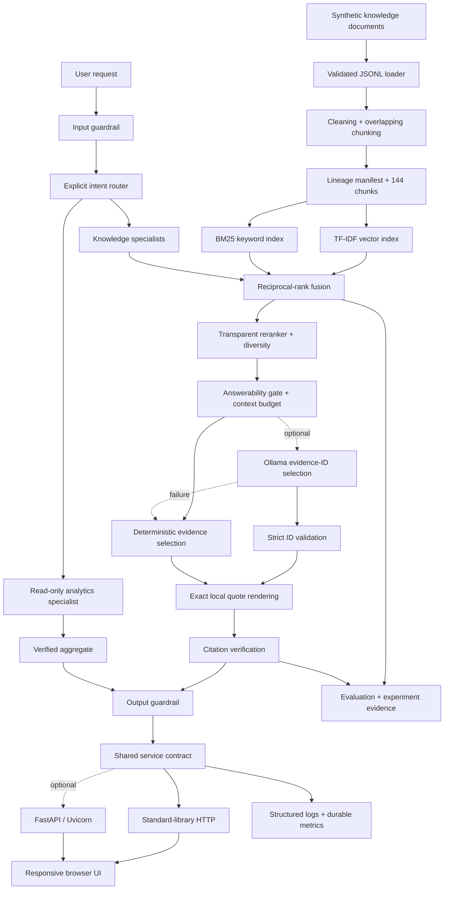

# Solution Architecture

## Purpose

The Enterprise RAG & Agentic AI Copilot demonstrates the complete engineering path around a trustworthy knowledge assistant: reproducible data, ingestion, retrieval, grounded responses, controlled workflows, guardrails, evaluation, serving, observability, and delivery.

Version 1.0 is local-first and open-source-first. Its default runtime uses deterministic Python components and no paid inference. Optional adapters add dense embeddings, FAISS, FastAPI, MLflow, or an Ollama-compatible model behind stable interfaces.

## Implemented system



## Architectural principles

### Deterministic baseline

The default path must reproduce without a model server, GPU, cloud account, or network connection. Fixed seeds, checked-in configuration, stable ordering, and SHA-256 manifests make data and quality changes visible.

### Evidence before generation

Retrieval and answerability decisions happen before any response is constructed. Answer text comes from exact source sentences, every inline citation resolves to a retrieved evidence object, and a verifier checks identifier order, uniqueness, metadata, source membership, and quote presence.

### Bounded agents

The agent layer is an explicit state machine rather than an unrestricted autonomous loop:

```text
input guardrail → intent router → one specialist → output guardrail
```

Specialists have narrow document policies or read-only aggregate operations. Conversation memory retains only the previous route and turn count required for follow-up routing. Same-conversation calls are serialized.

### Replaceable boundaries

Protocols and configuration isolate the retriever, answer generator, embedding adapter, tracking backend, service logic, and HTTP transport. Optional integrations do not change citation, guardrail, API, or evaluation contracts.

## Data and ingestion layer

The synthetic generator creates:

- 72 active knowledge documents across six document families
- 300 support cases marked synthetic
- 72 baseline retrieval questions

The ingestion pipeline validates records, normalizes text, detects duplicate IDs/content, filters status, and produces overlapping 60-word chunks with 10-word overlap. `ingestion_manifest.json` records input/output paths, counts, chunk settings, duplicate results, and SHA-256 hashes of both source and output.

All data is synthetic and contains no real customer or enterprise information.

## Retrieval layer

The primary vector baseline uses dependency-free TF-IDF embeddings and cosine similarity. The keyword path uses a dependency-free BM25 index. Reciprocal-rank fusion combines both candidate lists, after which a configurable reranker scores:

- vector similarity
- fused rank
- metadata overlap
- content overlap

Only one chunk per document is retained by default to improve source diversity. A calibrated score threshold controls answerability and abstention. The included 96-question hard benchmark contains paraphrased single-source, multi-source, and deliberately unanswerable questions.

Sentence Transformers and FAISS adapters are implemented as optional dense-retrieval boundaries and tested with small in-memory substitutes so the main quality gate remains lightweight.

## Context and answer layer

The context builder applies four controls:

1. maximum retrieval count
2. calibrated minimum query score
3. minimum individual evidence score
4. total context word budget

Accepted passages receive stable `C1`, `C2`, and subsequent identifiers. The default extractive generator selects the most relevant scoped evidence and copies the exact requirement sentence. Unsupported questions produce a citation-free refusal.

The optional Ollama adapter receives only the question and already-approved evidence. It must return one strict JSON field containing unique, allow-listed citation IDs. The application—not the model—then creates the answer. Invalid output, timeout, connection failure, HTTP error, or excessive response size triggers the deterministic fallback. A final verification failure is replaced by a fail-closed refusal.

## Agent and guardrail layer

The intent router supports:

| Route | Boundary |
|---|---|
| Policy | Policy, compliance, and operational-playbook evidence |
| Product | Product-guide evidence |
| Support | Support-procedure and FAQ evidence |
| Cross-functional | Multi-family knowledge evidence |
| Analytics | Counts and average resolution time over synthetic cases |
| General | Approved knowledge when no narrower route applies |

Input rules block prompt-instruction override attempts, credential/sensitive-data extraction, and requests to perform customer-account actions. Output rules require verified responses, matching inline citation records, safe citation-free refusals, and supported source types.

The analytics route performs read-only, deterministic filtering and aggregates. It never executes an external action.

## Service and UI layer

`CopilotService` owns request validation, workflow execution, latency measurement, privacy-preserving logging, metrics, safe exception handling, and the response envelope. Two HTTP adapters reuse it:

- the standard-library threaded server, which runs with no web framework
- an optional FastAPI adapter with the same routes and request limits

Both expose:

| Route | Purpose |
|---|---|
| `GET /` | Browser demonstration |
| `POST /ask` | Validated copilot request |
| `GET /health` | Readiness, version, and active knowledge backend |
| `GET /metrics` | Restart-aware service metric snapshot |

Transport boundaries enforce JSON content type, a 32 KiB body limit, malformed-input handling, and security headers. The browser UI renders text with safe DOM APIs and shows status, route, confidence, turn, latency, citations, workflow trace, generator, model, and fallback state.

## Observability and evaluation

Structured request events include timestamps, request ID, keyed question/conversation pseudonyms, route, status, latency, and safe error type. Raw prompts are not written to the request log. The HMAC key is process-local by default, limiting cross-restart correlation.

Service metrics persist total requests, status/route/guardrail/error counts, latency totals and averages, and observability persistence errors. Existing valid snapshots are loaded on restart.

Evaluation artifacts cover:

- baseline and hard retrieval
- hybrid tuning and retrieval
- grounded response and citation verification
- routing, knowledge regression, and adversarial guardrails
- real temporary HTTP-server validation
- optional model contract and fallback validation
- observability, experiment, container, and CI contracts
- final requirement-based project acceptance

Experiment tracking writes atomic local JSON by default and can use MLflow when explicitly configured and installed. Records contain parameters, selected metrics, tags, provenance hashes, and copied evaluation artifacts.

## Delivery architecture

The Docker image builds deterministic data/indexes, runs as a non-root user, exposes only the service port, and defines a health check. Compose adds a read-only root filesystem, a writable observability volume, localhost-only publication, a temporary filesystem, restart policy, and no-new-privileges.

GitHub Actions performs the actual Linux container build and health check after quality succeeds. The quality job regenerates inputs, checks Ruff lint/format, reproduces evaluations, runs pytest with a 90% coverage threshold, validates final acceptance, and uploads evidence.

## Trust boundaries and limitations

| Boundary | Version 1.0 control | Remaining production responsibility |
|---|---|---|
| User → service | Schema, character/body limits, content type, guardrails, security headers | Authentication, authorization, rate limits, WAF, TLS termination |
| Service → model | Local HTTP restriction, remote HTTPS requirement, timeout, response-size and strict JSON/ID validation | Endpoint identity, provider terms, outbound allow-list, secret rotation |
| Application → logs | HMAC pseudonyms and no raw request text | Centralized access control, retention, redaction review, SIEM integration |
| Container → host | Non-root, read-only root, bounded writable volume, health check | Image scanning, runtime policy, patching, resource quotas |
| Conversation state | Per-process locks and minimal memory | Shared state/expiry before multi-replica scaling |

The release is designed for a local portfolio demonstration using synthetic data. Real enterprise deployment requires the additional organizational controls listed in `cloud_deployment_runbook.md`.

## Completion and future extensions

Version 1.0 satisfies the local scope in `business_requirements.md`. Future additions—real identity, managed state, enterprise content connectors, hosted inference, or a cloud deployment—are integrations beyond the completed portfolio baseline, not missing phases. They should preserve the existing evidence, refusal, API, safety, and evaluation contracts.
